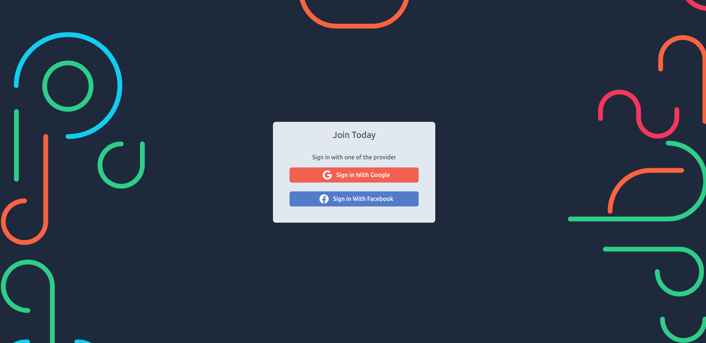
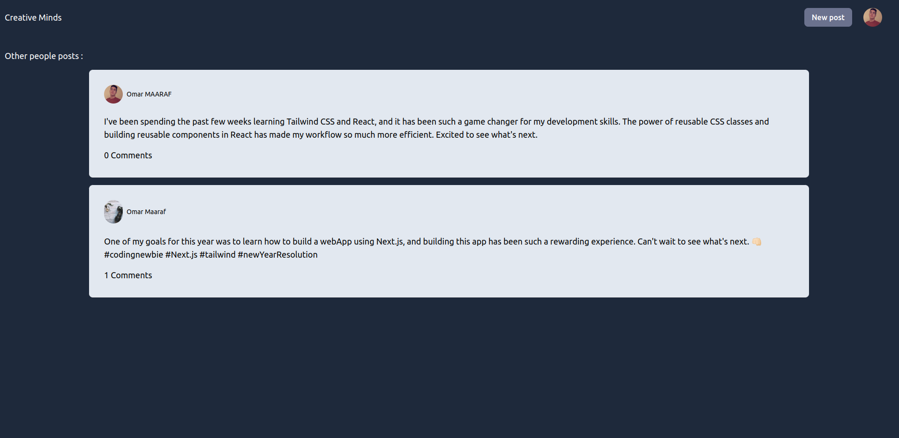
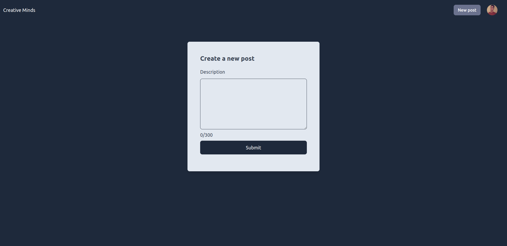
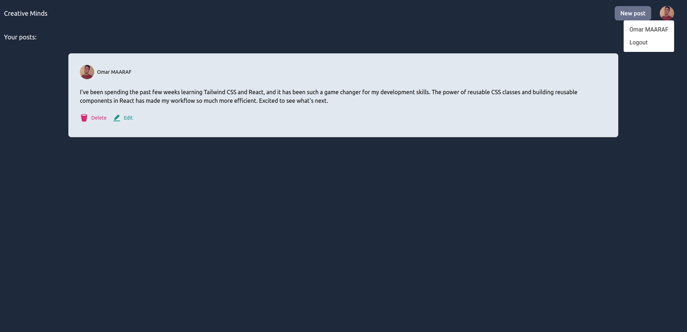

<h1>Next.js App with Firebase and Firestore</h1>

This app allows users to log in with Facebook or Google, create posts, and view and comment on other people's posts. It is built using <a href="https://nextjs.org/">Next.js</a> and utilizes <a href="https://firebase.google.com/">Firebase</a> for authentication and <a href="https://firebase.google.com/docs/firestore">Firestore</a> for storing and querying data. The app is styled using <a href="https://tailwindcss.com/">Tailwind CSS</a>.

<h2>Screenshots</h2>

  
   
  
  

<h2>Prerequisites</h2>

To run this app locally, you will need to have the following installed on your machine:

<ul>
  <li><a href="https://nodejs.org/">Node.js</a></li>
  <li><a href="https://yarnpkg.com/">Yarn</a> (optional, but recommended)</li>
</ul>
<h2>Deployment</h2>

To deploy the app, you can follow the instructions for <a href="https://nextjs.org/docs/deployment">deploying a Next.js app to Vercel</a>. Make sure to set the environment variables in your Vercel project as well.

Alternatively, you can deploy the app to any other hosting provider that supports Node.js.

<h2>License</h2>

This project is licensed under the MIT License. See the <a href="LICENSE">LICENSE</a> file for details.
